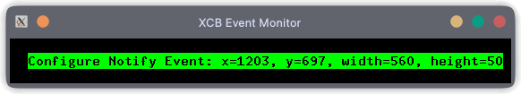

# XCBEM  



XCBEM is a really simple event monitor for X window system written in C using XCB.  

## Building

Make sure you have cmake & XCB libraries installed.

Paste the following code in your terminal to run this application:

```
git clone https://github.com/oddStoneGames/xcbem.git
cd xcbem
cmake -S . -B ./bin
cd bin
make
./xcbem
```

Install this program system-wide:
```
sudo make install
```

Uninstall:
```
sudo make uninstall
```
